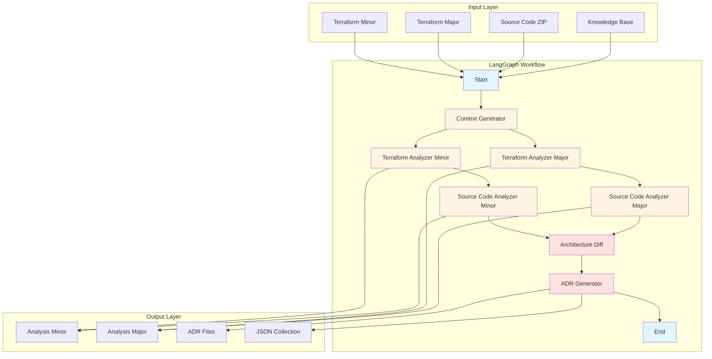

# ADR CodeSynth - Simplified 4-Agent Design with LangGraph

## Overview

This document presents a simplified multi-agent system design for ADR CodeSynth using **Python** and **LangGraph** for workflow orchestration. The design uses **4 agents** that can be called from within LangGraph nodes, with parallel execution for two system versions. 

---

## 1. Current System Issues

### 1.1 Methodological Issues

| Issue | Review Feedback | Priority |
|--------|---------------|-----------|
| **Unclear pipeline description** | It doesn't clearly show inputs/structure or execution phases | High |
| **Missing prompt documentation** | Prompts and rules used in each phase are not provided | High |
| **Unclear knowledge base** | Domain knowledge description is missing or insufficient | High |
| **Ambiguous architecture description generation** | How descriptions are generated is not explained | Medium |

### 1.2 Evaluation Issues

| Issue | Review Feedback | Priority |
|--------|---------------|-----------|
| **Missing replication package** | Dataset provided but insufficient for replication | High |
| **Unclear metrics** | DCavg, ELR, etc. not well defined | High |
| **No human-generated ADRs** | Cannot assess quality of comparison | Medium |
| **Unclear metric calculation** | Manual vs automatic not specified | Medium |

### 1.3 Missing Justifications

| Issue | Review Feedback | Priority |
|--------|---------------|-----------|
| **Why RAG?** | RAG motivation not clearly articulated | High |
| **Why GPT-4?** | No rationale for selected LLM | Medium |
| **Why source code only in Phase 2?** | Inconsistent approach | Medium |
| **Why custom metrics?** | Instead of standard metrics like BERT-Score | Medium |

### 1.5 RAG Implementation Gap

**Current Status**: The paper title mentions "A RAG-enriched LLM to synthesize Architecture Decision Records (ADR)" but the current system does **NOT** implement RAG (Retrieval-Augmented Generation).

**Decision**: The current approach of passing the knowledge base ([`knowledge/IAC.txt`](knowledge/IAC.txt)) as context directly to the LLM is **sufficient for the current use case**. A full RAG implementation with embeddings, vector database, and similarity search would be over-engineering.

**Rationale**:
- The knowledge base is relatively small (~200 lines) and domain-specific
- Direct context passing works effectively for this use case
- RAG would add complexity without significant benefit
- Future RAG implementation can be added as an enhancement when needed

**Note**: If future requirements demand RAG capabilities (e.g., larger knowledge bases, cross-project knowledge sharing), a lightweight retrieval mechanism can be added.

---

## 2. Proposed 4-Agent LangGraph Workflow

### 2.1 High-Level Architecture



### 2.2 LangGraph State Management

```python
from typing import TypedDict, Annotated, Sequence
from langgraph.graph import StateGraph, END
from langgraph.checkpoint.memory import MemorySaver

# Define workflow state
class ADRWorkflowState(TypedDict):
    # Inputs
    terraform_minor: str
    terraform_major: str
    source_code_zip: str
    knowledge_base: str

    # Intermediate results
    architectural_context: str
    project_structure: str
    source_code: str
    source_code_dict: dict
    extraction_metadata: dict
    terraform_analysis_minor: str
    terraform_analysis_major: str
    source_analysis_minor: str
    source_analysis_major: str
    improved_analysis_minor: str
    improved_analysis_major: str
    architecture_diff: str

    # Outputs
    adr_files: list[str]
    json_collection: dict

    # Metadata
    project_name: str
    timestamp: str
```

### 2.3 Agent 1: ContextGenerator

**Purpose**: Extract and prepare project structure and source code at the beginning of the workflow, making this information available to all downstream agents.

**Inputs**:
- Source code ZIP file
- Configuration parameters (max_files, max_file_size for summarization)

**Outputs**:
- Project structure analysis (directory layout, file organization)
- Extracted and optionally summarized source code content
- Metadata about extraction (file counts, summarization statistics)

**Implementation**:

```python
# src/agents/context_generator.py
import zipfile
from typing import Dict, Any
from pathlib import Path
from openai import AsyncOpenAI

class ContextGenerator:
    """Agent for extracting project structure and source code context."""

    def __init__(self, llm: AsyncOpenAI):
        self.llm = llm

    def _extract_project_structure(self, zip_path: str) -> Dict[str, Any]:
        """Extract and analyze the project structure from ZIP archive."""
        structure = {
            "directories": [],
            "python_files": [],
            "terraform_files": [],
            "config_files": [],
            "other_files": []
        }

        with zipfile.ZipFile(zip_path, 'r') as zip_ref:
            for file_info in zip_ref.infolist():
                path = Path(file_info.filename)
                
                if file_info.is_dir():
                    structure["directories"].append(str(path))
                elif path.suffix == '.py':
                    structure["python_files"].append(str(path))
                elif path.suffix == '.tf':
                    structure["terraform_files"].append(str(path))
                elif path.name in ['requirements.txt', 'pyproject.toml', 'setup.py',
                                   'package.json', 'tsconfig.json', 'Dockerfile']:
                    structure["config_files"].append(str(path))
                else:
                    structure["other_files"].append(str(path))

        return structure

    async def _extract_source_code(self, zip_path: str, max_files: int = 10,
                                  max_file_size: int = 5000) -> Dict[str, str]:
        """Extract source code content from ZIP archive with optional summarization.
        
        Args:
            zip_path: Path to ZIP archive
            max_files: Maximum number of files to extract
            max_file_size: Maximum file size in characters before summarizing
        
        Returns:
            Dictionary mapping file paths to content (full or summarized)
        """
        source_code = {}
        
        with zipfile.ZipFile(zip_path, 'r') as zip_ref:
            # Prioritize Python files
            python_files = [f for f in zip_ref.namelist() if f.endswith('.py')]
            
            # Limit number of files to avoid context overflow
            for file_path in python_files[:max_files]:
                try:
                    content = zip_ref.read(file_path).decode('utf-8', errors='ignore')
                    # Summarize large files to fit in context window
                    if len(content) > max_file_size:
                        content = await self._summarize_code_file(
                            file_path, content, max_file_size
                        )
                    source_code[file_path] = content
                except Exception as e:
                    continue

            # Add Terraform files if present
            tf_files = [f for f in zip_ref.namelist() if f.endswith('.tf')]
            for file_path in tf_files[:max_files]:
                try:
                    content = zip_ref.read(file_path).decode('utf-8', errors='ignore')
                    # Summarize large Terraform files
                    if len(content) > max_file_size:
                        content = await self._summarize_code_file(
                            file_path, content, max_file_size
                        )
                    source_code[file_path] = content
                except Exception as e:
                    continue

        return source_code

    async def _summarize_code_file(self, file_path: str, content: str,
                                  target_size: int) -> str:
        """Summarize a large code file to fit within context window."""
        file_ext = Path(file_path).suffix
        estimated_tokens = len(content) // 4
        
        if file_ext == '.py':
            summary_prompt = f"""
            Summarize the following Python code file for architectural analysis.
            
            File: {file_path}
            Approximate size: {len(content)} characters (~{estimated_tokens} tokens)
            
            Your task:
            1. Identify the main purpose and responsibility of this module
            2. List key classes and their responsibilities
            3. List key functions and their purposes
            4. Identify important imports and external dependencies
            5. Note any architectural patterns or design patterns used
            6. Identify communication patterns (API calls, database access, messaging, etc.)
            
            Keep the summary under {target_size} characters.
            Format as structured text with clear sections.
            
            CODE TO SUMMARIZE:
            {content}
            """
        elif file_ext == '.tf':
            summary_prompt = f"""
            Summarize the following Terraform file for architectural analysis.
            
            File: {file_path}
            Approximate size: {len(content)} characters (~{estimated_tokens} tokens)
            
            Your task:
            1. Identify the main resources being defined
            2. List key modules and their purposes
            3. Identify cloud services being used
            4. Note networking and security configurations
            5. Identify communication patterns between resources
            
            Keep the summary under {target_size} characters.
            Format as structured text with clear sections.
            
            CODE TO SUMMARIZE:
            {content}
            """
        else:
            summary_prompt = f"""
            Summarize the following code file for architectural analysis.
            
            File: {file_path}
            Approximate size: {len(content)} characters (~{estimated_tokens} tokens)
            
            Your task:
            1. Identify the main purpose and responsibility
            2. List key components and their roles
            3. Identify important dependencies
            4. Note any architectural patterns
            
            Keep the summary under {target_size} characters.
            Format as structured text with clear sections.
            
            CODE TO SUMMARIZE:
            {content}
            """
        
        response = await self.llm.chat.completions.create(
            model="gpt-4o",
            messages=[
                {"role": "system", "content": "You are an expert software architect specializing in code analysis and architectural pattern recognition. You create concise, structured summaries that capture essential architectural information."},
                {"role": "user", "content": summary_prompt}
            ],
            temperature=0.2,
            max_tokens=target_size // 4,
        )
        
        summary = response.choices[0].message.content
        
        return f"""[SUMMARIZED - Original size: {len(content)} chars, Summary size: {len(summary)} chars]

{summary}
"""

    def _format_project_structure(self, structure: Dict[str, Any]) -> str:
        """Format project structure for prompt."""
        lines = []
        lines.append("PROJECT STRUCTURE ANALYSIS")
        lines.append("=" * 50)
        lines.append(f"\nTotal Directories: {len(structure['directories'])}")
        lines.append(f"Python Files: {len(structure['python_files'])}")
        lines.append(f"Terraform Files: {len(structure['terraform_files'])}")
        lines.append(f"Configuration Files: {len(structure['config_files'])}")
        lines.append(f"Other Files: {len(structure['other_files'])}")
        
        lines.append("\n\nDIRECTORY LAYOUT:")
        for directory in structure['directories']:
            lines.append(f"  {directory}/")
        
        lines.append("\n\nPYTHON SOURCE FILES:")
        for py_file in structure['python_files']:
            lines.append(f"  - {py_file}")
        
        lines.append("\n\nTERRAFORM FILES:")
        for tf_file in structure['terraform_files']:
            lines.append(f"  - {tf_file}")
        
        lines.append("\n\nCONFIGURATION FILES:")
        for config_file in structure['config_files']:
            lines.append(f"  - {config_file}")
        
        return '\n'.join(lines)

    async def generate_context(self, source_code_zip: str,
                          max_files: int = 10,
                          max_file_size: int = 5000) -> Dict[str, Any]:
        """Generate complete project context including structure and source code.
        
        Args:
            source_code_zip: Path to ZIP archive
            max_files: Maximum number of files to extract
            max_file_size: Maximum file size before summarization
        
        Returns:
            Dictionary with project_structure, source_code, and metadata
        """
        # Extract project structure
        project_structure = self._extract_project_structure(source_code_zip)
        formatted_structure = self._format_project_structure(project_structure)
        
        # Extract source code with optional summarization
        source_code = await self._extract_source_code(
            source_code_zip,
            max_files=max_files,
            max_file_size=max_file_size
        )
        
        # Format source code for prompts
        formatted_source_code = "\n\n".join([
            f"=== {filepath} ===\n{content}"
            for filepath, content in source_code.items()
        ])
        
        # Calculate metadata
        total_files = len(source_code)
        summarized_files = sum(1 for content in source_code.values()
                          if "[SUMMARIZED" in content)
        
        return {
            "project_structure": formatted_structure,
            "source_code": formatted_source_code,
            "source_code_dict": source_code,
            "metadata": {
                "total_files": total_files,
                "summarized_files": summarized_files,
                "full_files": total_files - summarized_files
            }
        }
```

**Node Implementation**:

```python
# src/nodes/context_generator_node.py
from src.agents.context_generator import ContextGenerator

async def context_generator_node(state: ADRWorkflowState) -> ADRWorkflowState:
    """LangGraph node: Generate architectural context and extract project structure."""

    # Generate architectural context using LLM
    context_response = await llm.chat.completions.create(
        model="gpt-4o",
        messages=[
            {"role": "system", "content": "You are an expert software architect. Generate comprehensive theoretical context about software architecture, monolithic architecture, and microservices architecture."},
            {"role": "user", "content": "Generate a detailed theoretical introduction to software architecture, monolithic architecture, and microservices architecture. Format as Markdown."}
        ],
        temperature=0.3,
        max_tokens=2000,
    )

    state["architectural_context"] = context_response.choices[0].message.content

    # Extract project structure and source code using ContextGenerator agent
    context_gen = ContextGenerator(llm=llm)
    project_context = await context_gen.generate_context(
        state["source_code_zip"],
        max_files=10,
        max_file_size=5000
    )
    
    # Store extracted context in workflow state for all downstream agents
    state["project_structure"] = project_context["project_structure"]
    state["source_code"] = project_context["source_code"]
    state["source_code_dict"] = project_context["source_code_dict"]
    state["extraction_metadata"] = project_context["metadata"]

    return state
```

### 2.4 Agent 2: TerraformAnalyzer

**Purpose**: Analyze Terraform files for microservices patterns using IaC rule catalog.

**Inputs**:
- Architectural context (from Context Generator)
- Knowledge base (IaC rules)
- Terraform file (minor or major version)

**Outputs**:
- Terraform analysis with:
  - Microservices assessment (true/false)
  - Confidence score [0..1]
  - Evidence citations ([R#] for rules, [C#] for code)
  - JSON mini-report

**Implementation**:

```python
from src.agents.terraform_analyzer import TerraformAnalyzer

async def terraform_analyzer_node(state: ADRWorkflowState) -> ADRWorkflowState:
    """LangGraph node: Analyze Terraform file for microservices patterns."""

    analyzer = TerraformAnalyzer(
        llm=llm,
        knowledge_base=state["knowledge_base"]
    )

    result = await analyzer.analyze(
        terraform_code=state["terraform_minor"],
        context=state["architectural_context"],
        project_structure=state.get("project_structure", "")
    )

    if "minor" in state.get("terraform_minor", ""):
        state["terraform_analysis_minor"] = result.analysis
    else:
        state["terraform_analysis_major"] = result.analysis

    return state
```

**Agent Class**:

```python
# src/agents/terraform_analyzer.py
from typing import Dict, Any
from openai import AsyncOpenAI

class TerraformAnalyzer:
    """Agent for analyzing Terraform files against IaC rules."""
    
    def __init__(self, llm: AsyncOpenAI, knowledge_base: str):
        self.llm = llm
        self.knowledge_base = knowledge_base
    
    async def analyze(self, terraform_code: str, context: str, 
                  project_structure: str = "") -> Dict[str, Any]:
        """Analyze Terraform code for microservices patterns.
        
        # Handle large source code by summarizing if provided
        source_code_summary = ""
        if project_structure:
            source_code_summary = f"""
            
            PROJECT STRUCTURE:
            {project_structure}
            """
        
        prompt = f"""
        THEORETICAL CONTEXT (Markdown, for expert architects):
        {context}
        
        IAC RULE CATALOG — prioritize this evidence:
        {self.knowledge_base}
        
        PROJECT STRUCTURE (for context):
        {project_structure}
        
        TERRAFORM CODE:
        {terraform_code}
        
        TASK:
        1) Decide whether Terraform code describes a MICROservices architecture (true/false).
        2) Justify your assessment with explicit evidence, citing from:
           - [R#] for rule references from the IaC catalog, and
           - [C#] for specific code fragments in the Terraform file.
           Cover at least:
           - modularity (modules/reuse),
           - independent deployment of services,
           - communication style (async queues/events/APIs),
           - distributed deployment (networks/subnets, multiple services, orchestrators).
        3) Explicitly mention negative signals that point towards a monolith or tightly-coupled design
           (single deployment unit, one service, strong shared state, etc.).
        4) Provide a clear verdict and a confidence score in [0..1] with a short explanation.
        5) At the very end of the answer, emit a compact JSON mini-report in a single code block,
           with the following structure and no extra commentary:
        
        {{
          "microservices": true/false,
          "confidence": <float between 0 and 1>,
          "signals_for": ["...", "..."],
          "signals_against": ["...", "..."]
        }}
        
        Be concise, technical, and always cite [R#] and/or [C#] in each justification bullet.
        """
        
        response = await self.llm.chat.completions.create(
            model="gpt-4o",
            messages=[
                {"role": "system", "content": "You are an expert software architect in Infrastructure as Code and cloud-native microservices. You reason rigorously and write for expert architects."},
                {"role": "user", "content": prompt}
            ],
            temperature=0.2,
            max_tokens=1200,
        )
        
        return {
            "analysis": response.choices[0].message.content,
            "json_report": self._extract_json(response.choices[0].message.content)
        }
    
    def _extract_json(self, content: str) -> Dict[str, Any]:
        """Extract JSON mini-report from LLM response."""
        import re
        import json
        
        # Find JSON block in response
        json_match = re.search(r'```json\n(.*?)\n```', content, re.DOTALL)
        if json_match:
            return json.loads(json_match.group(1))
        return {}
```

### 2.4 Agent 2: SourceCodeAnalyzer (CodeAnalyzer)

**Purpose**: Analyze the project structure and source code to identify architectural patterns, validate Terraform analysis, and provide comprehensive architectural insights.

**Inputs**:
- Architectural context (from Context Generator)
- Previous Terraform analysis
- Source code ZIP containing:
  - Python source files (.py)
  - Terraform files (.tf)
  - Project directory structure
  - Configuration files
  - Dependencies (requirements.txt, pyproject.toml, etc.)

**Outputs**:
- Improved architecture analysis with:
  - Project structure analysis (directory layout, module organization)
  - Validation of previous Terraform analysis against actual code
  - Additional patterns identified (Strategy, CQRS, messaging, etc.)
  - Quality attributes assessment
  - Potential evolution paths
  - Code-level evidence for architectural decisions

**Implementation**:

```python
from src.agents.source_code_analyzer import SourceCodeAnalyzer

async def source_code_analyzer_node(state: ADRWorkflowState) -> ADRWorkflowState:
    """LangGraph node: Analyze project structure and validate analysis against source code."""

    analyzer = SourceCodeAnalyzer(llm=llm)

    # Use extracted project structure and source code from state (extracted by ContextGenerator)
    project_structure = state.get("project_structure", "")
    source_code = state.get("source_code", "")
    extraction_metadata = state.get("extraction_metadata", {})

    # Determine which version to analyze
    if "minor" in state.get("terraform_minor", ""):
        previous_analysis = state["terraform_analysis_minor"]
        version = "minor"
    else:
        previous_analysis = state["terraform_analysis_major"]
        version = "major"

    result = await analyzer.analyze(
        context=state["architectural_context"],
        previous_analysis=previous_analysis,
        source_code=source_code,
        version=version,
        project_structure=project_structure,
        extraction_metadata=extraction_metadata
    )

    if version == "minor":
        state["improved_analysis_minor"] = result.analysis
    else:
        state["improved_analysis_major"] = result.analysis

    return state
```

**Agent Class**:

```python
# src/agents/source_code_analyzer.py
import zipfile
from typing import Dict, Any
from pathlib import Path

class SourceCodeAnalyzer:
    """Agent for analyzing project structure and validating Terraform analysis against source code."""

    def __init__(self, llm: AsyncOpenAI):
        self.llm = llm

    def _extract_project_structure(self, zip_path: str) -> Dict[str, Any]:
        """Extract and analyze the project structure from ZIP archive."""
        structure = {
            "directories": [],
            "python_files": [],
            "terraform_files": [],
            "config_files": [],
            "other_files": []
        }

        with zipfile.ZipFile(zip_path, 'r') as zip_ref:
            for file_info in zip_ref.infolist():
                path = Path(file_info.filename)
                
                if file_info.is_dir():
                    structure["directories"].append(str(path))
                elif path.suffix == '.py':
                    structure["python_files"].append(str(path))
                elif path.suffix == '.tf':
                    structure["terraform_files"].append(str(path))
                elif path.name in ['requirements.txt', 'pyproject.toml', 'setup.py',
                                   'package.json', 'tsconfig.json', 'Dockerfile']:
                    structure["config_files"].append(str(path))
                else:
                    structure["other_files"].append(str(path))

        return structure

    def _extract_source_code(self, zip_path: str, max_files: int = 10,
                          max_file_size: int = 5000) -> Dict[str, str]:
        """Extract source code content from ZIP archive.
        
        Args:
            zip_path: Path to ZIP archive
            max_files: Maximum number of files to extract
            max_file_size: Maximum file size in characters before summarizing (default: 5000)
        
        Returns:
            Dictionary mapping file paths to content (full or summarized)
        """
        source_code = {}
        
        with zipfile.ZipFile(zip_path, 'r') as zip_ref:
            # Prioritize Python files
            python_files = [f for f in zip_ref.namelist() if f.endswith('.py')]
            
            # Limit number of files to avoid context overflow
            for file_path in python_files[:max_files]:
                try:
                    content = zip_ref.read(file_path).decode('utf-8', errors='ignore')
                    # Summarize large files to fit in context window
                    if len(content) > max_file_size:
                        content = await self._summarize_code_file(
                            file_path, content, max_file_size
                        )
                    source_code[file_path] = content
                except Exception as e:
                    continue

            # Add Terraform files if present
            tf_files = [f for f in zip_ref.namelist() if f.endswith('.tf')]
            for file_path in tf_files[:max_files]:
                try:
                    content = zip_ref.read(file_path).decode('utf-8', errors='ignore')
                    # Summarize large Terraform files
                    if len(content) > max_file_size:
                        content = await self._summarize_code_file(
                            file_path, content, max_file_size
                        )
                    source_code[file_path] = content
                except Exception as e:
                    continue

        return source_code

    async def _summarize_code_file(self, file_path: str, content: str,
                                  target_size: int) -> str:
        """Summarize a large code file to fit within context window.
        
        Args:
            file_path: Path to the code file
            content: Full content of the code file
            target_size: Target size in characters for the summary
        
        Returns:
            Summarized version of the code file
        """
        # Calculate approximate token count (rough estimate: 4 chars per token)
        estimated_tokens = len(content) // 4
        
        # Determine summary strategy based on file type
        file_ext = Path(file_path).suffix
        
        if file_ext == '.py':
            summary_prompt = f"""
            Summarize the following Python code file for architectural analysis.
            
            File: {file_path}
            Approximate size: {len(content)} characters (~{estimated_tokens} tokens)
            
            Your task:
            1. Identify the main purpose and responsibility of this module
            2. List key classes and their responsibilities
            3. List key functions and their purposes
            4. Identify important imports and external dependencies
            5. Note any architectural patterns or design patterns used
            6. Identify communication patterns (API calls, database access, messaging, etc.)
            
            Keep the summary under {target_size} characters.
            Format as structured text with clear sections.
            
            CODE TO SUMMARIZE:
            {content}
            """
        elif file_ext == '.tf':
            summary_prompt = f"""
            Summarize the following Terraform file for architectural analysis.
            
            File: {file_path}
            Approximate size: {len(content)} characters (~{estimated_tokens} tokens)
            
            Your task:
            1. Identify the main resources being defined
            2. List key modules and their purposes
            3. Identify cloud services being used
            4. Note networking and security configurations
            5. Identify communication patterns between resources
            
            Keep the summary under {target_size} characters.
            Format as structured text with clear sections.
            
            CODE TO SUMMARIZE:
            {content}
            """
        else:
            # Generic summary for other file types
            summary_prompt = f"""
            Summarize the following code file for architectural analysis.
            
            File: {file_path}
            Approximate size: {len(content)} characters (~{estimated_tokens} tokens)
            
            Your task:
            1. Identify the main purpose and responsibility
            2. List key components and their roles
            3. Identify important dependencies
            4. Note any architectural patterns
            
            Keep the summary under {target_size} characters.
            Format as structured text with clear sections.
            
            CODE TO SUMMARIZE:
            {content}
            """
        
        response = await self.llm.chat.completions.create(
            model="gpt-4o",
            messages=[
                {"role": "system", "content": "You are an expert software architect specializing in code analysis and architectural pattern recognition. You create concise, structured summaries that capture essential architectural information."},
                {"role": "user", "content": summary_prompt}
            ],
            temperature=0.2,
            max_tokens=target_size // 4,  # Convert to tokens
        )
        
        summary = response.choices[0].message.content
        
        # Add metadata about the summarization
        return f"""[SUMMARIZED - Original size: {len(content)} chars, Summary size: {len(summary)} chars]

{summary}
"""

    def _format_project_structure(self, structure: Dict[str, Any]) -> str:
        """Format project structure for prompt."""
        lines = []
        lines.append("PROJECT STRUCTURE ANALYSIS")
        lines.append("=" * 50)
        lines.append(f"\nTotal Directories: {len(structure['directories'])}")
        lines.append(f"Python Files: {len(structure['python_files'])}")
        lines.append(f"Terraform Files: {len(structure['terraform_files'])}")
        lines.append(f"Configuration Files: {len(structure['config_files'])}")
        lines.append(f"Other Files: {len(structure['other_files'])}")
        
        lines.append("\n\nDIRECTORY LAYOUT:")
        for directory in structure['directories']:
            lines.append(f"  {directory}/")
        
        lines.append("\n\nPYTHON SOURCE FILES:")
        for py_file in structure['python_files']:
            lines.append(f"  - {py_file}")
        
        lines.append("\n\nTERRAFORM FILES:")
        for tf_file in structure['terraform_files']:
            lines.append(f"  - {tf_file}")
        
        lines.append("\n\nCONFIGURATION FILES:")
        for config_file in structure['config_files']:
            lines.append(f"  - {config_file}")
        
        return '\n'.join(lines)

    async def analyze(self, context: str, previous_analysis: str,
                  source_code: str, version: str,
                  project_structure: str = "") -> Dict[str, Any]:
        """Validate and improve architecture analysis using source code and project structure."""

        prompt = f"""
        You are given four sources of information about a {'hybrid' if version == 'minor' else 'microservices-based'} solution:

        1. A theoretical introduction in Markdown about software architecture, monolithic architecture, and microservices architecture.
        2. A previous architecture analysis derived from the Terraform file ({version} evolution).
        3. The actual source code used in the solution (Python and Terraform files).
        4. The project structure showing the organization of files and directories.

        Use ALL of them as context.

        == THEORETICAL CONTEXT ==
        {context}

        == PREVIOUS TERRAFORM-BASED ANALYSIS ({version.upper()}) ==
        {previous_analysis}

        == PROJECT STRUCTURE ==
        {project_structure}

        == SOURCE CODE (PY / TF) ==
        {source_code}

        Your tasks:

        1. Analyze the project structure to understand:
           - How the codebase is organized (monolithic vs modular)
           - Separation of concerns between modules
           - Presence of service boundaries
           - Dependency management patterns

        2. Validate or correct the previous Terraform-based analysis using:
           - The real source code implementation
           - The project structure and organization
           - Evidence from actual code patterns

        3. Identify additional architectures or patterns present by examining:
           - Code organization and module boundaries
           - Communication patterns between components
           - Data access patterns (e.g., separate data stores per service)
           - Deployment configuration in code
           - Design patterns (Strategy, Factory, CQRS, etc.)

        4. Write an improved architecture analysis that:
           - Clearly describes the current architecture based on code evidence.
           - Explains how and why it is {'hybrid (monolith + microservices)' if version == 'minor' else 'microservices-based'}.
           - Highlights key quality attributes (scalability, maintainability, performance, security, etc.).
           - Discusses its potential evolution towards a more microservices-based or serverless architecture.
           - Cites specific code files and patterns that support your analysis.

        Target audience: expert software architects.
        Return the answer in well-structured Markdown, with clear headings and sections.
        """
        
        response = await self.llm.chat.completions.create(
            model="gpt-4o",
            messages=[
                {"role": "system", "content": "You are a software architect expert in hybrid architectures, Infrastructure as Code, and design patterns. You reason rigorously and write for expert architects."},
                {"role": "user", "content": prompt}
            ],
            temperature=0.4,
            max_tokens=2000,
        )
        
        return {"analysis": response.choices[0].message.content}
```

### 2.5 Agent 3: ArchitectureDiff

**Purpose**: Compare hybrid and microservices analyses to identify key architectural decisions.

**Inputs**:
- Improved analysis for minor version (hybrid)
- Improved analysis for major version (microservices)
- Architectural context

**Outputs**:
- Architecture comparison highlighting:
  - Key differences between versions
  - Important architectural decisions
  - Migration patterns identified
  - Decision points for ADR generation

**Implementation**:

```python
from src.agents.architecture_diff import ArchitectureDiff

async def architecture_diff_node(state: ADRWorkflowState) -> ADRWorkflowState:
    """LangGraph node: Compare two architecture analyses."""
    
    diff_agent = ArchitectureDiff(llm=llm)
    
    result = await diff_agent.compare(
        hybrid_analysis=state["improved_analysis_minor"],
        microservices_analysis=state["improved_analysis_major"],
        context=state["architectural_context"]
    )
    
    state["architecture_diff"] = result.comparison
    return state
```

**Agent Class**:

```python
# src/agents/architecture_diff.py
from typing import Dict, Any

class ArchitectureDiff:
    """Agent for comparing architecture analyses."""
    
    def __init__(self, llm: AsyncOpenAI):
        self.llm = llm
    
    async def compare(self, hybrid_analysis: str, microservices_analysis: str, 
                 context: str) -> Dict[str, Any]:
        """Compare hybrid and microservices architecture analyses."""
        
        prompt = f"""
        You are given two versions of an architecture analysis for the same application,
        each one coming from a different implementation and infrastructure:
        
        - The hybrid analysis describes a {'hybrid architecture with a monolithic component and a single Lambda function.'}
        - The microservices analysis describes the same application {'fully migrated to a microservices-based architecture, with multiple Lambda functions and an API Gateway.'}
        
        If available, you may also use the following theoretical introduction
        about software architecture, monolithic architecture, and microservices architecture:
        
        == THEORETICAL CONTEXT ==
        {context}
        
        == ARCHITECTURE ANALYSIS - HYBRID VERSION ==
        {hybrid_analysis}
        
        == ARCHITECTURE ANALYSIS - MICROSERVICES VERSION ==
        {microservices_analysis}
        
        Your task is:
        
        1. Identify the most important architecture decisions involved in the migration
           from the HYBRID version to the MICROSERVICES version.
        2. For each of these decisions, provide:
           - A brief description of the decision
           - The key differences that necessitated this decision
           - The architectural impact of this decision
        
        Focus on decisions that are clearly implied by the differences between the HYBRID
        and MICROSERVICES versions (for example, migration strategy, decomposition approach,
        communication style, deployment model, data management).
        
        Do not invent technologies or details that are not supported by the analyses.
        Limit the output to at most 5 key decisions.
        
        Return the answer in well-structured Markdown, with clear headings for each decision.
        """
        
        response = await self.llm.chat.completions.create(
            model="gpt-4o",
            messages=[
                {"role": "system", "content": "You are a software architect expert in architecture evolution and decision analysis. You reason rigorously and write for expert architects."},
                {"role": "user", "content": prompt}
            ],
            temperature=0.3,
            max_tokens=2000,
        )
        
        return {"comparison": response.choices[0].message.content}
```

### 2.6 Agent 4: ADRGenerator

**Purpose**: Generate Architecture Decision Records (ADRs) from architecture comparison.

**Inputs**:
- Architecture comparison result
- Architectural context
- ADR template specifications

**Outputs**:
- Multiple ADR files in MADR format with sections:
  - Title, Status, Motivation
  - Decision Drivers, Main Decision, Alternatives
  - Pros, Cons, Consequences
  - Validation, Additional Information
- JSON collection of all ADRs

**Implementation**:

```python
from src.agents.adr_generator import ADRGenerator

async def adr_generator_node(state: ADRWorkflowState) -> ADRWorkflowState:
    """LangGraph node: Generate ADRs from architecture comparison."""
    
    generator = ADRGenerator(llm=llm)
    
    result = await generator.generate(
        comparison=state["architecture_diff"],
        context=state["architectural_context"],
        project_name=state["project_name"]
    )
    
    state["adr_files"] = result.adr_files
    state["json_collection"] = result.json_collection
    
    return state
```

**Agent Class**:

```python
# src/agents/adr_generator.py
import json
import re
from typing import Dict, Any, List
from openai import AsyncOpenAI

class ADRGenerator:
    """Agent for generating Architecture Decision Records."""
    
    def __init__(self, llm: AsyncOpenAI):
        self.llm = llm
    
    async def generate(self, comparison: str, context: str, 
                  project_name: str) -> Dict[str, Any]:
        """Generate ADRs from architecture comparison."""
        
        prompt = f"""
        You are given a comparison of two architecture analyses for the same application.
        Based on this comparison, you must generate Architecture Decision Records (ADRs)
        for the most important decisions identified in the migration.
        
        == ARCHITECTURE COMPARISON ==
        {comparison}
        
        == THEORETICAL CONTEXT ==
        {context}
        
        Your task is:
        
        For each important decision identified in the comparison, write a complete ADR
        using the following template, which combines MADR-style elements with
        expert-recommended sections.
        
        For each ADR, follow these rules:
        
        - Start the ADR with a top-level heading of the form:
          "# ADR: <short decision name>"
        
        - Then, include the following sections in this exact order, with these headings:
        
        ## Title
        ## Status
        ## Motivation
        ## Decision Drivers
        ## Main Decision
        ## Alternatives
        ## Pros
        ## Cons
        ## Consequences
        ## Validation
        ## Additional Information
        
        SECTION DEFINITIONS AND RULES
        -----------------------------
        
        - **Title**
          - Short and descriptive of the purpose of the architecture decision.
          - Avoid unnecessary technology names that are not central to the decision.
        
        - **Status**
          - Must be one of: Proposed, Accepted, Rejected, Deprecated, Superseded.
          - Choose the one that best matches the information you can infer.
        
        - **Motivation**
          - Explain the problem being solved by the decision.
          - Blend system context, constraints, and requirements.
          - Clearly describe WHY a decision is needed now.
          - Write continuous prose (no bullet points).
        
        - **Decision Drivers**
          - Bullet list of the main drivers of the decision:
            - functional requirements,
            - non-functional requirements (quality attributes),
            - constraints (organizational, technical, regulatory, etc.).
        
        - **Main Decision**
          - Describe the chosen architecture decision in detail.
          - Explain how it addresses the motivation and decision drivers.
          - Include any relevant assumptions and clarifications.
          - Write continuous prose (no bullet points).
        
        - **Alternatives**
          - List other architecture options that could have addressed the same problem,
            but were not chosen.
          - Do NOT repeat the main decision here.
          - For each alternative, provide a short name and a brief one-line description.
        
        - **Pros**
          - For EACH decision (main decision and alternatives):
            - Create a subheading with the decision/option name and list its advantages.
          - Example structure:
            - Main decision:
              - Pros:
                - ...
                  - ...
            - Alternative 1:
              - Pros:
                - ...
                  - ...
        
        - **Cons**
          - For EACH decision (main decision and alternatives):
            - Create a subheading with the decision/option name and list its disadvantages.
          - Example structure:
            - Main decision:
              - Cons:
                - ...
                  - ...
            - Alternative 1:
              - Cons:
                - ...
                  - ...
        
        - **Consequences**
          - Describe the positive and negative consequences and trade-offs of the chosen
            main decision, including:
            - short-term vs long-term impact,
            - impact on key quality attributes (scalability, performance, maintainability,
              security, resilience, etc.).
        
        - **Validation**
          - Include this section only if you can reasonably infer how the decision can be
            or has been validated (e.g., tests, prototypes, benchmarks, reviews).
          - If nothing is known, you may write:
            - "Validation to be defined in future iterations."
        
        - **Additional Information**
          - Use this section only for:
            - references,
            - links,
            - related ADRs,
            - issue or pull request IDs,
            - other notes that do not fit in previous sections.
          - If there is nothing relevant, you may leave it empty or omit it.
        
        Additional guidelines:
        
        - Focus on decisions that are clearly implied by the differences between the HYBRID
          and MICROSERVICES versions (for example, migration strategy, decomposition approach,
          communication style, deployment model, data management).
        - Do not invent technologies or details that are not supported by the analyses.
        - Limit the output to at most 5 ADRs that capture the key decisions in this migration.
        - If you detect more than one important decision, produce multiple ADRs, one after another.
        - Separate each ADR visually by starting each one with a line that begins with "# ADR:".
        
        Return ONLY the ADRs in Markdown format, with no additional explanation or commentary.
        """
        
        response = await self.llm.chat.completions.create(
            model="gpt-4o",
            messages=[
                {"role": "system", "content": "You are a software architect expert in documenting architecture decisions (ADR) using MADR-inspired templates. You reason rigorously and write for expert architects."},
                {"role": "user", "content": prompt}
            ],
            temperature=0.3,
            max_tokens=3000,
        )
        
        # Parse ADRs from response
        adr_blocks = self._split_adrs(response.choices[0].message.content)
        
        # Save each ADR to a separate file
        adr_files = []
        for idx, block in enumerate(adr_blocks, start=1):
            filename = f"output-adrs/{project_name}_ADR_{idx}.txt"
            with open(filename, "w", encoding="utf-8") as f:
                f.write(block)
            adr_files.append(filename)
        
        # Parse ADRs to JSON
        adr_json_list = []
        for adr_file in adr_files:
            with open(adr_file, "r", encoding="utf-8") as f:
                content = f.read()
            adr_obj = self._parse_adr_markdown(content)
            adr_obj["source_file"] = adr_file
            adr_json_list.append(adr_obj)
        
        # Save JSON collection
        json_output = f"project-inputs/{project_name}_adr_collection.json"
        with open(json_output, "w", encoding="utf-8") as f:
            json.dump(adr_json_list, f, ensure_ascii=False, indent=2)
        
        return {
            "adr_files": adr_files,
            "json_collection": {
                "filename": json_output,
                "adrs": adr_json_list
            }
        }
    
    def _split_adrs(self, text: str) -> List[str]:
        """Split ADRs by detecting lines that start with '# ADR:'."""
        adr_blocks = []
        current_adr_lines = []
        
        for line in text.split('\n'):
            if line.strip().lower().startswith('# adr'):
                if current_adr_lines:
                    adr_blocks.append('\n'.join(current_adr_lines))
                current_adr_lines = [line]
            else:
                current_adr_lines.append(line)
        
        if current_adr_lines:
            adr_blocks.append('\n'.join(current_adr_lines))
        
        return adr_blocks
    
    def _parse_adr_markdown(self, text: str) -> Dict[str, Any]:
        """Parse a single ADR in Markdown and return a dict with the main fields."""
        lines = text.split('\n')
        sections = {}
        current_section = None
        current_content = []
        
        for line in lines:
            stripped = line.strip()
            
            # Top-level ADR heading
            if stripped.lower().startswith('# adr'):
                adr_name = stripped.replace('# ADR:', '').replace('# ADR', '').strip()
                sections['adr_name'] = adr_name
                current_section = None
                current_content = []
            # Section heading
            elif stripped.startswith('## '):
                if current_section:
                    sections[current_section] = '\n'.join(current_content).strip()
                current_section = stripped[3:].strip()
                current_content = []
            # Accumulate content
            elif current_section:
                current_content.append(line)
        
        # Add last section
        if current_section:
            sections[current_section] = '\n'.join(current_content).strip()
        
        def parse_bullet_list(section_name: str) -> List[str]:
            raw_lines = sections.get(section_name, '').split('\n')
            items = []
            for line in raw_lines:
                s = line.strip()
                if s.startswith('-') or s.startswith('*'):
                    items.append(s.lstrip('-* ').strip())
            return items
        
        return {
            'adr_name': sections.get('adr_name', ''),
            'title': sections.get('Title', ''),
            'status': sections.get('Status', ''),
            'motivation': sections.get('Motivation', ''),
            'decision_drivers': parse_bullet_list('Decision Drivers'),
            'main_decision': sections.get('Main Decision', ''),
            'alternatives': parse_bullet_list('Alternatives'),
            'pros': sections.get('Pros', ''),
            'cons': sections.get('Cons', ''),
            'consequences': sections.get('Consequences', ''),
            'validation': sections.get('Validation', ''),
            'additional_information': sections.get('Additional Information', '')
        }
```

### 2.7 LangGraph Workflow Construction

```python
# src/workflow.py
from typing import Dict, Any
from langgraph.graph import StateGraph, END
from langgraph.checkpoint.memory import MemorySaver

from src.state import ADRWorkflowState
from src.agents.terraform_analyzer import terraform_analyzer_node
from src.agents.source_code_analyzer import source_code_analyzer_node
from src.agents.architecture_diff import architecture_diff_node
from src.agents.adr_generator import adr_generator_node

def create_workflow() -> StateGraph:
    """Create and compile a LangGraph workflow."""
    
    # Create workflow graph
    workflow = StateGraph(ADRWorkflowState)
    
    # Add nodes
    workflow.add_node("context_generator", context_generator_node)
    workflow.add_node("terraform_analyzer_minor", terraform_analyzer_node)
    workflow.add_node("terraform_analyzer_major", terraform_analyzer_node)
    workflow.add_node("source_code_analyzer_minor", source_code_analyzer_node)
    workflow.add_node("source_code_analyzer_major", source_code_analyzer_node)
    workflow.add_node("architecture_diff", architecture_diff_node)
    workflow.add_node("adr_generator", adr_generator_node)
    
    # Define edges (workflow)
    workflow.set_entry_point("context_generator")
    
    # After context, run both Terraform analyzers in parallel
    workflow.add_edge("context_generator", "terraform_analyzer_minor")
    workflow.add_edge("context_generator", "terraform_analyzer_major")
    
    # After Terraform analysis, validate with source code (parallel)
    workflow.add_edge("terraform_analyzer_minor", "source_code_analyzer_minor")
    workflow.add_edge("terraform_analyzer_major", "source_code_analyzer_major")
    
    # After validation, compare results (sequential - wait for both to complete)
    workflow.add_edge("source_code_analyzer_minor", "architecture_diff")
    workflow.add_edge("source_code_analyzer_major", "architecture_diff")
    
    # Generate ADRs from comparison
    workflow.add_edge("architecture_diff", "adr_generator")
    
    # End workflow
    workflow.add_edge("adr_generator", END)
    
    # Compile with checkpoint support
    app = workflow.compile(checkpointer=MemorySaver())
    
    return app
```

### 2.8 Context Generator Node

The context generator node generates the architectural context and extracts the project structure from the ZIP file to make it available to all downstream nodes.

```python
# src/nodes/context_generator.py
from src.agents.source_code_analyzer import SourceCodeAnalyzer

async def context_generator_node(state: ADRWorkflowState) -> ADRWorkflowState:
    """LangGraph node: Generate architectural context and extract project structure."""

    # Generate architectural context using LLM
    context_response = await llm.chat.completions.create(
        model="gpt-4o",
        messages=[
            {"role": "system", "content": "You are an expert software architect. Generate comprehensive theoretical context about software architecture, monolithic architecture, and microservices architecture."},
            {"role": "user", "content": "Generate a detailed theoretical introduction to software architecture, monolithic architecture, and microservices architecture. Format as Markdown."}
        ],
        temperature=0.3,
        max_tokens=2000,
    )

    state["architectural_context"] = context_response.choices[0].message.content

    # Extract project structure from ZIP for downstream nodes
    analyzer = SourceCodeAnalyzer(llm=llm)
    project_structure = analyzer._extract_project_structure(state["source_code_zip"])
    formatted_structure = analyzer._format_project_structure(project_structure)
    state["project_structure"] = formatted_structure

    return state
```

---

## 3. Prioritized Improvements 

### 3.1 High Priority (Must Fix)

| # | Improvement | Addresses | Implementation Effort |
|---|-------------|---------------------|
| 1 | **Document all prompts and templates** | Missing prompt documentation | Low |
| 2 | **Create replication package** | Missing replication package | Medium |
| 3 | **Clarify pipeline workflow** | Unclear pipeline description | Medium |
| 4 | **Document knowledge base** | Unclear domain knowledge | Low |
| 5 | **Explain RAG motivation** | Missing RAG justification | Medium |

### 3.2 Medium Priority (Should Fix)

| # | Improvement | Addresses | Implementation Effort |
|---|-------------|---------------------|
| 6 | **Define metrics clearly** | Unclear metrics (DCavg, ELR) | Medium |
| 7 | **Add human-generated ADRs** | No quality comparison | High |
| 8 | **Explain metric calculation** | Manual vs automatic unclear | Low |
| 9 | **Add discussion section** | Missing implications discussion | Medium |
| 10 | **Fix Figure 1 alignment** | Figure doesn't match text | Low |

### 3.3 Low Priority (Nice to Have)

| # | Improvement | Addresses | Implementation Effort |
|---|-------------|---------------------|
| 11 | **Remove unclear figures** | Word clouds don't contribute | Low |
| 12 | **Fix broken references** | Missing reference (Fig. ??) | Low |
| 13 | **Justify GPT-4 choice** | No LLM rationale | Low |
| 14 | **Explain source code timing** | Why only in Phase 2? | Medium |
| 15 | **Consider standard metrics** | Why custom metrics? | Medium |

---

## 4. Technology Stack

### 4.1 Core Technologies

| Component | Technology | Version | Purpose |
|------------|-----------|-----------|---------|
| **Language** | Python | 3.12+ | Core implementation |
| **LLM Framework** | LangChain | Latest | LLM orchestration |
| **Workflow Engine** | LangGraph | Latest | Stateful workflow management |
| **LLM Provider** | OpenAI | GPT-4o | Text generation |
| **Type Checking** | pydantic | Latest | Configuration validation |
| **Async Runtime** | asyncio | Built-in | Concurrent execution |

### 4.2 Supporting Libraries

| Library | Purpose |
|----------|---------|
| `openai` | OpenAI API client |
| `python-dotenv` | Environment variable management |
| `pydantic` | Data validation |
| `zipfile` | ZIP archive extraction |
| `structlog` | Structured logging |

---

## 5. Project Structure

```
adrtfcodesynth/
├── src/
│   ├── __init__.py
│   ├── config.py              # Configuration management
│   ├── state.py               # LangGraph state definitions
│   ├── agents/                # Agent implementations
│   │   ├── __init__.py
│   │   ├── terraform_analyzer.py
│   │   ├── source_code_analyzer.py
│   │   ├── architecture_diff.py
│   │   └── adr_generator.py
│   ├── utils/                 # Utility functions
│   │   ├── __init__.py
│   │   ├── file_utils.py
│   │   └── logging_utils.py
│   └── workflow.py            # LangGraph workflow construction
├── prompts/                     # Prompt templates
│   ├── context.txt
│   ├── terraform_analysis.txt
│   ├── source_code_validation.txt
│   ├── architecture_diff.txt
│   └── adr_generation.txt
├── knowledge/
│   ├── IAC.txt
│   └── IAC-spa.txt
├── output-adrs/
├── project-inputs/
├── tests/
│   ├── __init__.py
│   ├── test_agents.py
│   ├── test_workflow.py
│   └── fixtures/
├── pyproject.toml
├── requirements.txt
├── README.md
└── .env.example
```

---

## 6. Implementation Plan

### Phase 1: Foundation (Week 1)

**Goals**:
- Set up project structure
- Implement configuration management
- Add logging framework
- Create state definitions

**Deliverables**:
- Project skeleton
- Configuration module
- Logging setup
- State definitions

### Phase 2: Core Agents (Weeks 2-3)

**Goals**:
- Implement TerraformAnalyzer agent
- Implement SourceCodeAnalyzer agent
- Implement ArchitectureDiff agent
- Implement ADRGenerator agent
- Add unit tests

**Deliverables**:
- 4 agent implementations
- Agent tests
- Prompt templates

### Phase 3: Workflow Integration (Week 4)

**Goals**:
- Implement Context Generator node
- Build LangGraph workflow
- Add parallel execution support
- Create integration tests

**Deliverables**:
- Complete workflow
- Integration tests
- Workflow visualization

### Phase 4: Documentation (Week 5)

**Goals**:
- Document all prompts
- Create replication package
- Write user guide
- Add API documentation

**Deliverables**:
- Prompt documentation
- Replication package
- User guide
- API docs

### Phase 5: Evaluation (Week 6)

**Goals**:
- Define metrics clearly
- Add human-generated ADRs
- Implement metric calculation
- Create evaluation script

**Deliverables**:
- Metric definitions
- Human ADR dataset
- Evaluation script
- Evaluation report

---

## 7. Key Improvements from Feedback

### 7.1 Methodological Clarity

1. **Explicit Pipeline Definition**
   - Clear LangGraph workflow with defined states and transitions
   - Each node has single responsibility
   - State management is explicit and typed
   - Parallel execution of independent nodes is explicit

2. **Prompt Documentation**
   - All prompts stored as separate files in `prompts/` directory
   - Prompt templates are versioned
   - Prompt engineering decisions are documented

3. **Knowledge Base Documentation**
   - [`knowledge/IAC.txt`](knowledge/IAC.txt) is clearly documented
   - Rule catalog is structured and traceable
   - Domain knowledge is explicit

### 7.2 Reproducibility

1. **Replication Package**
   - Complete codebase with all dependencies
   - Prompt templates included
   - Test data provided
   - Clear installation instructions

2. **Configuration Management**
   - Environment variables for API keys
   - Configuration file for project settings
   - Type-safe configuration with pydantic

3. **Logging and Debugging**
   - Structured logging with context
   - Debug mode for detailed traces
   - Error handling with retries

### 7.3 Evaluation Rigor

1. **Clear Metrics**
   - Metrics are explicitly defined
   - Calculation method is documented
   - Metrics are justified

2. **Human Baseline**
   - Include human-generated ADRs
   - Compare against human quality
   - Provide quality benchmarks

3. **Standard Metrics**
   - Consider using BERT-Score or similar
   - Document why custom metrics are used
   - Provide metric comparison

---

## 8. Next Steps

1. **Review and Approve Design**
   - Review this simplified 4-agent design
   - Approve LangGraph workflow
   - Confirm technology stack

2. **Start Implementation**
   - Begin with Phase 1 (Foundation)
   - Follow implementation plan
   - Create PRs for each phase

3. **Address Feedback**
   - Focus on high-priority items
   - Document all decisions
   - Prepare for resubmission

4. **Test and Validate**
   - Run integration tests
   - Validate with sample projects
   - Collect metrics

---

## Appendix: LangGraph Benefits

| Benefit | Description |
|----------|-------------|
| **State Management** | Explicit state definition with type hints |
| **Visualization** | Built-in workflow visualization |
| **Persistence** | Checkpoint support for long-running workflows |
| **Parallel Execution** | Automatic parallelization of independent nodes |
| **Debugging** | Easy debugging with state inspection |
| **Flexibility** | Easy to add/remove nodes |
| **Testing** | Simple unit testing of individual nodes |
