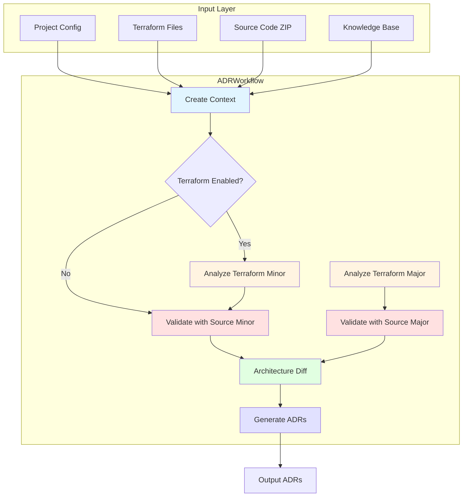
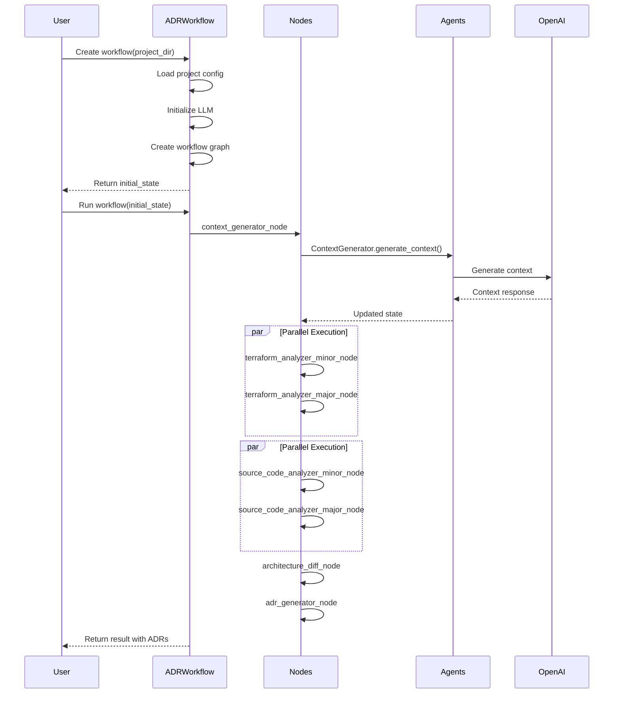

# ADR CodeSynth Project - Comprehensive Analysis Report

## Executive Summary

This report provides a detailed analysis of the **ADR CodeSynth** project, a Python-based system that uses LangGraph for workflow orchestration to analyze Infrastructure as Code (IaC) configurations and generate Architecture Decision Records (ADRs). The system uses a multi-agent architecture with specialized agents for different analysis tasks, powered by OpenAI's GPT models.

**Key Finding**: The project has evolved from a monolithic notebook to a well-structured multi-agent system using LangGraph, demonstrating good modularity, maintainability, and scalability.

---

## 1. Project Structure Analysis

### 1.1 Current Directory Structure

```
adrtfcodesynth/
├── adrtfcodesynth.ipynb          # Root notebook (legacy)
├── docs/
│   └── Paper_ADR.pdf            # Research paper/documentation
├── knowledge/
│   ├── IAC.txt                  # IaC analysis rules (English)
│   └── IAC-spa.txt              # IaC analysis rules (Spanish)
├── output-adrs/                 # Generated ADR outputs
│   ├── abelaa_ADR_*.txt
│   ├── chef_ADR_*.txt
│   └── serverlessmike_ADR_*.txt
├── plans/
│   └── project-analysis-report.md
├── project-inputs/
│   ├── project-config.yaml      # Global project configuration
│   ├── abelaa/
│   │   ├── abelaa_adr_collection.json
│   │   ├── abelaa_app.zip
│   │   ├── abelaa_cloud_evolucion_mayor.tf
│   │   ├── abelaa_cloud_evolucion_menor.tf
│   │   └── project-config.yaml
│   ├── chef/
│   │   ├── chef_adr_collection.json
│   │   ├── chef_app.zip
│   │   ├── chef_cloud_evolucion_mayor.tf
│   │   ├── chef_cloud_evolucion_menor.tf
│   │   └── project-config.yaml
│   └── serverlessmike/
│       ├── serverlessmike_adr_collection.json
│       ├── serverlessmike_app.zip
│       ├── serverlessmike_cloud_evolucion_mayor.tf
│       ├── serverlessmike_cloud_evolucion_menor.tf
│       └── project-config.yaml
└── src/                         # Main source code package
    ├── __init__.py
    ├── config.py                # Configuration management
    ├── main.py                  # Entry point
    ├── main_workflow.ipynb      # Testing/demo notebook
    ├── state.py                 # Workflow state definitions
    ├── workflow.py              # Main workflow orchestration
    ├── agents/                  # Agent implementations
    │   ├── __init__.py
    │   ├── adr_generator.py
    │   ├── architecture_diff.py
    │   ├── context_generator.py
    │   ├── source_code_analyzer.py
    │   └── terraform_analyzer.py
    └── nodes/                   # LangGraph nodes
        ├── __init__.py
        ├── adr_generator_node.py
        ├── architecture_diff_node.py
        ├── context_generator_node.py
        ├── source_code_analyzer_node.py
        └── terraform_analyzer_node.py
```

### 1.2 File Purposes

| File/Directory | Purpose |
|---------------|---------|
| [`src/config.py`](src/config.py) | Configuration management with Pydantic, LLM initialization |
| [`src/main.py`](src/main.py) | Entry point, loads environment variables |
| [`src/state.py`](src/state.py) | ADRWorkflowState TypedDict definition |
| [`src/workflow.py`](src/workflow.py) | ADRWorkflow class, LangGraph orchestration |
| [`src/agents/`](src/agents/) | Specialized LLM agents for each task |
| [`src/nodes/`](src/nodes/) | LangGraph node functions wrapping agents |
| [`src/main_workflow.ipynb`](src/main_workflow.ipynb) | Testing and demonstration notebook |
| [`knowledge/IAC.txt`](knowledge/IAC.txt) | Rules for analyzing IaC code for microservices patterns |
| [`output-adrs/`](output-adrs/) | Generated ADR text files |
| [`project-inputs/`](project-inputs/) | Input data for different projects |

---

## 2. Current Architecture Analysis

### 2.1 Architecture Overview

The system now uses a **multi-agent architecture** built on **LangGraph** for workflow orchestration:



### 2.2 Technology Stack

| Component | Technology | Purpose |
|-----------|-----------|---------|
| Language | Python 3.11+ | Core implementation |
| AI Models | OpenAI GPT-4o/GPT-4.1-mini | LLM for analysis |
| Workflow Orchestration | LangGraph | Graph-based workflow management |
| State Management | TypedDict | Type-safe state definitions |
| Configuration | Pydantic + python-dotenv | Settings management |
| Logging | Python logging | Application logging |
| Environment | Jupyter Notebook | Testing and demos |

### 2.3 Key Dependencies

```
langgraph>=0.2.0
langchain-core>=0.3.0
langchain-openai>=0.2.0
pydantic>=2.0.0
pydantic-settings>=2.0.0
python-dotenv>=1.0.0
pyyaml>=6.0.0
```

---

## 3. Component Analysis

### 3.1 Configuration Module ([`src/config.py`](src/config.py))

The configuration module provides:

- **Settings class**: Pydantic-based settings loaded from environment variables
  - `openai_api_key`: OpenAI API key
  - `openai_model`: Model to use (default: gpt-4.1-mini)
  - `temperature`: LLM temperature (default: 0.1)
  - `max_tokens`: Max tokens for responses

- **LLMConfig class**: Manages LLM instance creation and caching

- **Global functions**:
  - `initialize_llm()`: Initialize global LLM instance
  - `load_project_config()`: Load project-specific YAML configuration
  - `get_settings()`: Get global settings
  - `get_llm_config()`: Get LLM configuration
  - `get_project_config()`: Get project configuration

### 3.2 State Management ([`src/state.py`))

The workflow state is defined using TypedDict:

```python
class ADRWorkflowState(TypedDict):
    # Inputs
    terraform_minor: str           # Path to minor Terraform
    terraform_major: str           # Path to major Terraform
    source_code_zip: str          # Path to source ZIP
    knowledge_base: str            # Path to knowledge base
    
    # Intermediate results
    architectural_context: str      # Generated context
    project_structure: str         # Extracted structure
    source_code: str               # Extracted code
    source_code_dict: dict         # Code by file
    extraction_metadata: dict      # Extraction stats
    terraform_analysis_minor: str  # Minor analysis
    terraform_analysis_major: str  # Major analysis
    improved_analysis_minor: str   # Validated minor
    improved_analysis_major: str  # Validated major
    architecture_diff: str         # Comparison
    
    # Outputs
    adr_files: dict               # Generated ADRs
    
    # Metadata
    project_name: str
    timestamp: str
```

### 3.3 Workflow Orchestration ([`src/workflow.py`](src/workflow.py))

The ADRWorkflow class provides:

- **Initialization**: Loads project config, initializes LLM
- **Workflow Creation**: Builds LangGraph with configurable nodes
- **Execution**: Runs the workflow with checkpoint support
- **Visualization**: Generates workflow graph images

Key methods:
- `__init__()`: Initialize with project directory
- `initialize_project()`: Load configuration
- `create()`: Create and configure workflow
- `get_graph()`: Get workflow visualization
- `run()`: Execute workflow

### 3.4 Agents ([`src/agents/`](src/agents/))

Five specialized agents handle different tasks:

| Agent | Purpose | Key Methods |
|-------|---------|-------------|
| ContextGenerator | Generate architectural context, extract project structure | `generate_context()` |
| TerraformAnalyzer | Analyze Terraform for microservices patterns | `analyze()` |
| SourceCodeValidator | Validate analysis with source code | `analyze()` |
| ArchitectureDiff | Compare minor and major analyses | `compare()` |
| ADRGenerator | Generate ADRs from comparison | `generate()` |

### 3.5 Nodes ([`src/nodes/`](src/nodes/))

LangGraph nodes wrapping agents:

| Node | Agent | Function |
|------|-------|----------|
| context_generator_node | ContextGenerator | Generate context, extract code |
| terraform_analyzer_minor_node | TerraformAnalyzer | Analyze minor version |
| terraform_analyzer_major_node | TerraformAnalyzer | Analyze major version |
| source_code_analyzer_minor_node | SourceCodeValidator | Validate minor analysis |
| source_code_analyzer_major_node | SourceCodeValidator | Validate major analysis |
| architecture_diff_node | ArchitectureDiff | Compare analyses |
| adr_generator_node | ADRGenerator | Generate final ADRs |

---

## 4. Workflow Execution Flow

### 4.1 Complete Workflow



### 4.2 Node Processing Details

1. **Context Generator Node**
   - Extracts source code from ZIP
   - Generates project structure analysis
   - Creates architectural context (optional)
   - Returns: project_structure, source_code, source_code_dict

2. **Terraform Analyzer Nodes** (minor/major)
   - Loads Terraform file content
   - Optionally includes knowledge base
   - Analyzes for microservices patterns
   - Returns: confidence, signals_for, signals_against

3. **Source Code Analyzer Nodes** (minor/major)
   - Validates Terraform analysis against code
   - Identifies additional patterns
   - Returns: improved_analysis

4. **Architecture Diff Node**
   - Compares minor and major analyses
   - Identifies key decisions
   - Returns: architecture_diff

5. **ADR Generator Node**
   - Generates ADRs from comparison
   - Returns: adr_files dict

---

## 5. Project Configuration

### 5.1 Global Configuration ([`project-inputs/project-config.yaml`])

```yaml
# Global settings (if needed)
```

### 5.2 Project-Specific Configuration

Each project has its own `project-config.yaml`:

```yaml
project_name: "abelaa"
terraform_minor: "abelaa_cloud_evolucion_menor.tf"
terraform_major: "abelaa_cloud_evolucion_mayor.tf"
source_code_zip: "abelaa_app.zip"
knowledge_base: "knowledge/IAC.txt"

llm:
  model: "gpt-4o"
  temperature: 0.3
  max_tokens: 2000

context_generation:
  max_files: 10
  max_file_size: 5000

analysis:
  use_spanish_knowledge_base: false
  knowledge_base_language: "en"
```

---

## 6. Usage Patterns

### 6.1 Basic Usage

```python
from workflow import ADRWorkflow

# Create workflow
workflow = ADRWorkflow(project_dir="project-inputs/abelaa")

# Create workflow graph
initial_state = workflow.create(include_terraform=True, include_knowledge=True)

# Run workflow
result = await workflow.run(initial_state)

# Access ADRs
for filename, content in result["adr_files"].items():
    print(f"{filename}: {len(content)} chars")
```

### 6.2 Notebook Usage

The [`src/main_workflow.ipynb`](src/main_workflow.ipynb) notebook provides:
- Step-by-step workflow demonstration
- Individual node testing capabilities
- Result visualization
- Debugging support

---

## 7. Improvements Over Original Design

### 7.1 Architecture Improvements

| Aspect | Before (Notebook) | After (LangGraph) |
|--------|------------------|------------------|
| Modularity | Single notebook | Modular Python package |
| State Management | Global variables | TypedDict with reducers |
| Workflow | Sequential cells | Graph-based with parallel execution |
| Error Handling | Limited | Structured error handling |
| Testing | Difficult | Unit testable components |
| Reusability | Notebook-dependent | Importable modules |
| Configuration | Hard-coded | YAML-based project config |
| Checkpointing | None | LangGraph MemorySaver |

### 7.2 New Features

- **Parallel Execution**: Terraform and source code analysis run in parallel
- **Configurable Workflow**: Enable/disable Terraform analysis
- **Knowledge Base Support**: Optional knowledge base integration
- **Checkpoint Support**: Resume interrupted workflows
- **Project Configuration**: YAML-based project settings
- **Extensible Design**: Easy to add new agents/nodes

---

## 8. Knowledge Base

### 8.1 IaC Analysis Rules ([`knowledge/IAC.txt`])

The knowledge base provides structured rules for analyzing IaC code:

**Dimensions Analyzed**:
1. **Modularity** (+2 to -2 points)
   - Service-specific modules
   - Separate states
   - Clean interfaces
   - Module reuse

2. **Independent Services** (+2 to -2 points)
   - Per-service autoscaling
   - Service-based security
   - Databases per service
   - Health checks

3. **Asynchronous Communication** (+2 to -2 points)
   - SQS/SNS/EventBridge
   - Kafka
   - DLQ and retries
   - Event publishing

4. **Distributed Deployment** (+2 to -2 points)
   - Multi-AZ deployment
   - Load balancers
   - Replicas
   - Data replication

### 8.2 Bilingual Support

- English: [`IAC.txt`](knowledge/IAC.txt)
- Spanish: [`IAC-spa.txt`](knowledge/IAC-spa.txt)

---

## 9. Output Format

### 9.1 ADR Structure

Each ADR follows MADR-inspired template:
- Title
- Status (Proposed/Accepted/Rejected/Deprecated)
- Motivation
- Decision Drivers
- Main Decision
- Alternatives
- Pros/Cons for each option
- Consequences
- Validation
- Additional Information

### 9.2 Generated Files

- `project_ADR_1.md` through `project_ADR_5.md`
- Stored in [`output-adrs/`](output-adrs/) directory
- JSON collection in project directory

---

## 10. Conclusion

The ADR CodeSynth project has evolved from a monolithic notebook into a well-architected multi-agent system using LangGraph. The new design provides:

- **Modularity**: Clear separation between agents and nodes
- **Scalability**: Parallel execution where possible
- **Maintainability**: Type-safe, testable Python code
- **Flexibility**: Configurable workflow with optional features
- **Extensibility**: Easy to add new agents or modify existing ones

The refactored architecture successfully addresses many of the limitations identified in the original analysis, making the system suitable for production use and future expansion.

---

## Appendix A: File Reference Map

| Component | File | Description |
|-----------|------|-------------|
| Entry Point | [`src/main.py`](src/main.py) | Loads environment variables |
| Configuration | [`src/config.py`](src/config.py) | Settings and LLM management |
| State | [`src/state.py`](src/state.py) | Workflow state definitions |
| Workflow | [`src/workflow.py`](src/workflow.py) | Main orchestration class |
| Agents | [`src/agents/*.py`](src/agents/) | Specialized LLM agents |
| Nodes | [`src/nodes/*.py`](src/nodes/) | LangGraph node functions |
| Demo | [`src/main_workflow.ipynb`](src/main_workflow.ipynb) | Testing notebook |
| Knowledge | [`knowledge/IAC.txt`](knowledge/IAC.txt) | Analysis rules |
