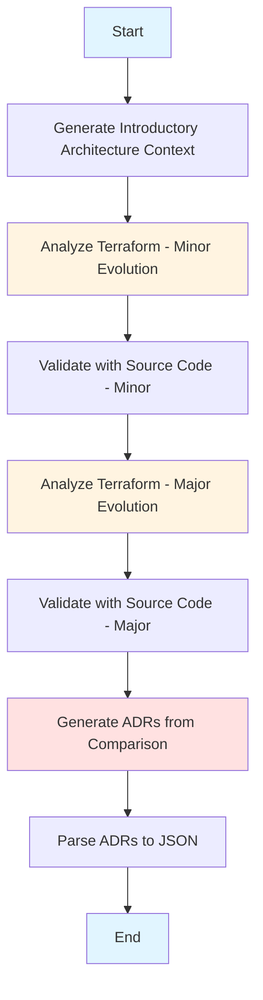
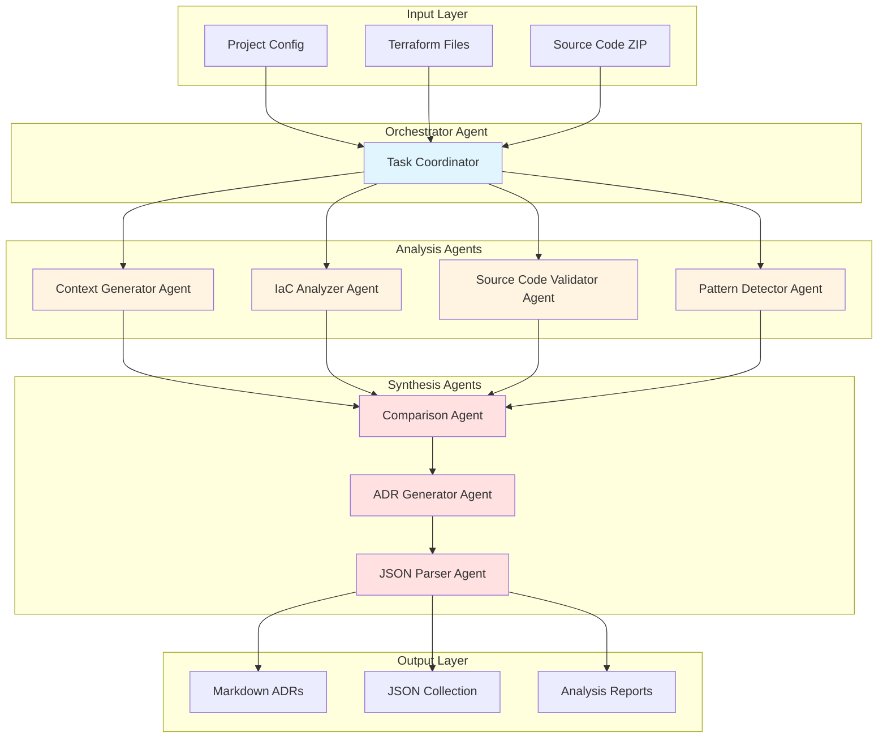
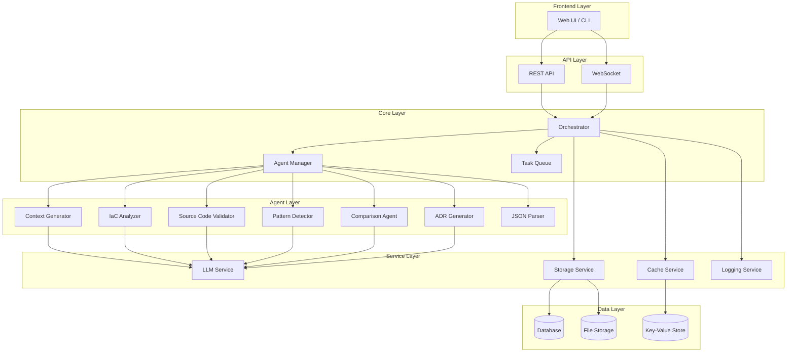

# ADR CodeSynth Project - Comprehensive Analysis Report

## Executive Summary

This report provides a detailed analysis of the **ADR CodeSynth** project, a Jupyter notebook-based system that analyzes Infrastructure as Code (IaC) configurations to generate Architecture Decision Records (ADRs). The system currently operates as a monolithic notebook with sequential processing, using OpenAI's GPT-4o model to analyze Terraform configurations and generate architectural insights.

**Key Finding**: The project demonstrates a solid foundation for automated architecture analysis but would benefit significantly from evolving into a multi-agent system for improved modularity, scalability, and maintainability.

---

## 1. Project Structure Analysis

### 1.1 Directory Structure

```
adrtfcodesynth/
├── adrtfcodesynth.ipynb          # Main Jupyter notebook (1431 lines)
├── docs/
│   └── Paper_ADR.pdf            # Research paper/documentation
├── knowledge/
│   ├── IAC.txt                  # IaC analysis rules (English)
│   └── IAC-spa.txt             # IaC analysis rules (Spanish)
├── output-adrs/                 # Generated ADR outputs
│   ├── abelaa_ADR_*.txt
│   ├── chef_ADR_*.txt
│   └── serverlessmike_ADR_*.txt
└── project-inputs/
    ├── abelaa/
    │   ├── abelaa_adr_collection.json
    │   ├── abelaa_app.zip
    │   ├── abelaa_cloud_evolucion_mayor.tf
    │   └── abelaa_cloud_evolucion_menor.tf
    ├── chef/
    │   ├── chef_adr_collection.json
    │   ├── chef_app.zip
    │   ├── chef_cloud_evolucion_mayor.tf
    │   └── chef_cloud_evolucion_menor.tf
    └── serverlessmike/
        ├── serverlessmike_adr_collection.json
        ├── serverlessmike_app.zip
        ├── serverlessmike_cloud_evolucion_mayor.tf
        └── serverlessmike_cloud_evolucion_menor.tf
```

### 1.2 File Purposes

| File/Directory | Purpose |
|---------------|---------|
| [`adrtfcodesynth.ipynb`](adrtfcodesynth.ipynb) | Main processing notebook containing all logic |
| [`knowledge/IAC.txt`](knowledge/IAC.txt) | Rules for analyzing IaC code for microservices patterns |
| [`knowledge/IAC-spa.txt`](knowledge/IAC-spa.txt) | Spanish version of IaC analysis rules |
| `output-adrs/` | Directory containing generated ADR text files |
| `project-inputs/` | Input data for different projects (Terraform files, ZIP archives, JSON collections) |

---

## 2. Current Architecture Analysis

### 2.1 Processing Flow

The current system follows a **sequential, monolithic processing pipeline**:



### 2.2 Notebook Cell Breakdown

| Cell | Purpose | Dependencies |
|------|---------|--------------|
| 1-2 | Install dependencies & load API key | openai, python-dotenv |
| 3 | Generate architectural context (Markdown) | OpenAI GPT-4o |
| 4 | Analyze minor evolution Terraform | [`IAC.txt`](knowledge/IAC.txt), Terraform file |
| 5 | Validate with source code (minor) | ZIP archive, previous analysis |
| 6 | Analyze major evolution Terraform | [`IAC.txt`](knowledge/IAC.txt), Terraform file |
| 7 | Validate with source code (major) | ZIP archive, previous analysis |
| 8 | Generate ADRs from comparison | Both analyses, architectural context |
| 9 | Parse ADRs to JSON | Generated ADR text files |

### 2.3 Technology Stack

| Component | Technology | Version |
|-----------|-----------|---------|
| Language | Python | 3.12.11 |
| AI Model | OpenAI GPT-4o | Latest |
| IaC Analysis | Terraform/OpenTofu | - |
| Output Format | Markdown, JSON | - |
| Environment | Jupyter Notebook | - |

### 2.4 Dependencies

```python
# Core dependencies
openai>=2.8.0
python-dotenv
zipfile
json
glob
```

---

## 3. Current Workflow Detailed Analysis

### 3.1 Phase 1: Context Generation

**Purpose**: Generate theoretical background on software architecture

**Process**:
- Uses GPT-4o to generate Markdown content about:
  - Software Architecture
  - Monolithic Architecture
  - Microservices Architecture

**Output**: [`intro_architecture.md`](intro_architecture.md) (saved for reuse)

### 3.2 Phase 2: Terraform Analysis (Minor Evolution)

**Purpose**: Analyze the initial/hybrid architecture

**Process**:
1. Reads Terraform file (`*_cloud_evolucion_menor.tf`)
2. Loads IaC rules from [`IAC.txt`](knowledge/IAC.txt)
3. Constructs prompt with:
   - Theoretical context
   - IaC rules
   - Terraform code
4. Calls GPT-4o for analysis
5. Outputs structured analysis with:
   - Assessment (microservices: true/false)
   - Justification with evidence citations
   - Negative signals
   - Verdict and confidence score
   - JSON mini-report

**Output**: `{repo}_architecture_analysis1.txt`

### 3.3 Phase 3: Source Code Validation (Minor)

**Purpose**: Validate Terraform analysis against actual source code

**Process**:
1. Reads previous Terraform analysis
2. Extracts Python/Terraform files from ZIP archive
3. Constructs prompt with:
   - Theoretical context
   - Previous analysis
   - Source code
4. Calls GPT-4o for improved analysis
5. Identifies additional patterns (Strategy, decoupling, messaging, etc.)

**Output**: `{repo}_architecture_analysis_improved1.txt`

### 3.4 Phase 4: Terraform Analysis (Major Evolution)

**Purpose**: Analyze the evolved/microservices architecture

**Process**: Similar to Phase 2 but with `*_cloud_evolucion_mayor.tf`

**Output**: `{repo}_architecture_analysis2.txt`

### 3.5 Phase 5: Source Code Validation (Major)

**Purpose**: Validate microservices analysis against source code

**Process**: Similar to Phase 3 but for microservices version

**Output**: `{repo}_architecture_analysis_improved2.txt`

### 3.6 Phase 6: ADR Generation

**Purpose**: Generate Architecture Decision Records

**Process**:
1. Loads both improved analyses (hybrid and microservices)
2. Constructs prompt with:
   - Both analyses
   - Theoretical context
3. Calls GPT-4o to identify key decisions
4. Generates ADRs following MADR-inspired template with sections:
   - Title
   - Status
   - Motivation
   - Decision Drivers
   - Main Decision
   - Alternatives
   - Pros (for each option)
   - Cons (for each option)
   - Consequences
   - Validation
   - Additional Information

**Output**: Multiple `{repo}_ADR_{n}.txt` files

### 3.7 Phase 7: JSON Conversion

**Purpose**: Parse ADRs into structured JSON

**Process**:
1. Reads all ADR text files
2. Parses Markdown structure
3. Extracts sections into JSON fields
4. Saves consolidated JSON collection

**Output**: `{repo}_adr_collection.json`

---

## 4. Knowledge Base Analysis

### 4.1 IaC Analysis Rules ([`knowledge/IAC.txt`](knowledge/IAC.txt))

The knowledge base provides **structured rules** for analyzing IaC code:

**Dimensions Analyzed**:
1. **Modularity** (+2 to -2 points)
   - Service-specific modules
   - Separate states
   - Clean interfaces
   - Module reuse

2. **Independent Services** (+2 to -2 points)
   - Per-service autoscaling
   - Service-based security
   - Databases per service
   - Health checks

3. **Asynchronous Communication** (+2 to -2 points)
   - SQS/SNS/EventBridge
   - Kafka
   - DLQ and retries
   - Event publishing

4. **Distributed Deployment** (+2 to -2 points)
   - Multi-AZ deployment
   - Load balancers
   - Replicas
   - Data replication

**Scoring System**:
- 0-2: LOW
- 3-4: MEDIUM
- 5-6: HIGH

### 4.2 Bilingual Support

The system supports both English and Spanish:
- [`IAC.txt`](knowledge/IAC.txt) - English version
- [`IAC-spa.txt`](knowledge/IAC-spa.txt) - Spanish version

---

## 5. Output Format Analysis

### 5.1 ADR Structure

Each ADR follows a consistent structure:

```markdown
# ADR: <Decision Name>

## Title
<Decision Title>

## Status
Proposed | Accepted | Rejected | Deprecated | Superseded

## Motivation
<Continuous prose explaining the problem>

## Decision Drivers
- <driver 1>
- <driver 2>
...

## Main Decision
<Continuous prose describing the chosen approach>

## Alternatives
- <alternative 1>
- <alternative 2>
...

## Pros
- Main decision:
  - Pros:
    - <pro 1>
    - <pro 2>
- Alternative 1:
  - Pros:
    - <pro 1>
...

## Cons
- Main decision:
  - Cons:
    - <con 1>
    - <con 2>
...

## Consequences
<Description of positive and negative consequences>

## Validation
<How the decision can be validated>

## Additional Information
<References, links, related ADRs>
```

### 5.2 JSON Collection Format

```json
[
  {
    "adr_name": "Decision Name",
    "title": "Decision Title",
    "status": "Accepted",
    "motivation": "...",
    "decision_drivers": ["driver1", "driver2"],
    "main_decision": "...",
    "alternatives": ["alt1", "alt2"],
    "pros": "...",
    "cons": "...",
    "consequences": "...",
    "validation": "...",
    "additional_information": "...",
    "source_file": "filename.txt"
  }
]
```

---

## 6. Identified Issues and Limitations

### 6.1 Architecture Issues

| Issue | Severity | Impact |
|-------|----------|--------|
| **Monolithic Design** | High | Difficult to maintain, test, and extend |
| **Sequential Processing** | Medium | No parallelization, slow execution |
| **Hard-coded Paths** | Medium | Inflexible file handling |
| **No Error Handling** | High | System failures are not graceful |
| **No Logging** | Medium | Difficult to debug issues |
| **No Configuration Management** | Medium | API key and settings embedded in code |
| **No Input Validation** | Medium | Invalid inputs cause crashes |
| **No Caching** | Low | Repeated API calls for same context |

### 6.2 Code Quality Issues

| Issue | Severity | Description |
|-------|----------|-------------|
| **No Type Hints** | Low | Python code lacks type annotations |
| **No Docstrings** | Medium | Functions lack documentation |
| **Magic Numbers** | Low | Hard-coded values (e.g., temperature=0.2) |
| **Inconsistent Naming** | Low | Mixed English/Spanish variable names |
| **No Unit Tests** | High | No test coverage |
| **No CI/CD** | Medium | No automated testing or deployment |
| **No Version Control Strategy** | Medium | Notebook format is not ideal for version control |

### 6.3 Functional Limitations

| Limitation | Impact |
|------------|--------|
| **Single Project Processing** | Can only process one project at a time |
| **No Batch Processing** | Cannot process multiple projects automatically |
| **No Progress Tracking** | No visibility into processing status |
| **No Retry Logic** | API failures cause complete failure |
| **No Cost Estimation** | No tracking of OpenAI API costs |
| **No Result Comparison** | Cannot compare ADRs across projects |
| **No Human Review Workflow** | No mechanism for manual review/approval |
| **Limited IaC Support** | Only Terraform is supported |

### 6.4 Scalability Issues

| Issue | Impact |
|-------|--------|
| **Notebook Format** | Not suitable for production deployment |
| **No Asynchronous Processing** | Cannot handle concurrent requests |
| **No Database** | No persistent storage for results |
| **No API Interface** | Cannot be integrated with other systems |
| **No Horizontal Scaling** | Cannot distribute load across instances |

---

## 7. Multi-Agent System Architecture Proposal

### 7.1 Overview

Transform the monolithic notebook into a **multi-agent system** with specialized agents for different tasks:



### 7.2 Agent Specifications

#### 7.2.1 Orchestrator Agent

**Responsibilities**:
- Coordinate task execution
- Manage agent communication
- Handle error recovery
- Track progress
- Manage resource allocation

**Capabilities**:
- Task queue management
- Agent lifecycle management
- State persistence
- Retry logic
- Parallel execution coordination

#### 7.2.2 Context Generator Agent

**Responsibilities**:
- Generate architectural context
- Cache generated context
- Support multiple languages
- Update context based on new knowledge

**Capabilities**:
- Context generation with GPT-4o
- Context versioning
- Multi-language support
- Knowledge base integration

#### 7.2.3 IaC Analyzer Agent

**Responsibilities**:
- Parse Terraform/OpenTofu files
- Apply IaC analysis rules
- Generate structured analysis
- Calculate scores

**Capabilities**:
- Terraform parsing
- Rule engine application
- Evidence extraction
- Score calculation
- JSON mini-report generation

#### 7.2.4 Source Code Validator Agent

**Responsibilities**:
- Extract code from ZIP archives
- Validate Terraform analysis
- Identify additional patterns
- Generate improved analysis

**Capabilities**:
- ZIP extraction
- Code parsing (Python, Terraform)
- Pattern detection (Strategy, CQRS, etc.)
- Cross-validation logic

#### 7.2.5 Pattern Detector Agent

**Responsibilities**:
- Identify design patterns
- Detect architectural styles
- Classify communication patterns
- Map to quality attributes

**Capabilities**:
- Pattern recognition
- Architectural style classification
- Quality attribute mapping
- Anti-pattern detection

#### 7.2.6 Comparison Agent

**Responsibilities**:
- Compare hybrid vs microservices analyses
- Identify key differences
- Highlight evolution points
- Extract decision points

**Capabilities**:
- Diff analysis
- Change detection
- Decision extraction
- Impact analysis

#### 7.2.7 ADR Generator Agent

**Responsibilities**:
- Generate ADRs from comparisons
- Follow MADR template
- Ensure consistency
- Validate ADR completeness

**Capabilities**:
- ADR template application
- Content generation
- Consistency checking
- Completeness validation

#### 7.2.8 JSON Parser Agent

**Responsibilities**:
- Parse ADR Markdown
- Extract structured data
- Validate JSON schema
- Generate collections

**Capabilities**:
- Markdown parsing
- JSON generation
- Schema validation
- Collection management

### 7.3 System Architecture



### 7.4 Technology Stack Recommendations

| Layer | Technology | Rationale |
|-------|-----------|-----------|
| **Frontend** | React + TypeScript | Modern, component-based UI |
| **Backend** | FastAPI | Fast, async, type-safe |
| **Orchestration** | Celery + Redis | Distributed task queue |
| **Agent Framework** | LangChain | LLM agent orchestration |
| **LLM Service** | OpenAI API | Current provider, easy to swap |
| **Database** | PostgreSQL | Relational, ACID compliant |
| **Cache** | Redis | Fast in-memory caching |
| **File Storage** | MinIO/S3 | Object storage for files |
| **Message Queue** | RabbitMQ/Redis | Reliable messaging |
| **Logging** | ELK Stack | Centralized logging |
| **Monitoring** | Prometheus + Grafana | Metrics and dashboards |

---

## 8. Implementation Roadmap

### 8.1 Phase 1: Refactoring (Weeks 1-2)

**Goals**:
- Extract notebook code to Python modules
- Add type hints and docstrings
- Implement basic error handling
- Add logging
- Create configuration management

**Deliverables**:
- Modular Python package structure
- Configuration file support
- Basic logging framework
- Error handling patterns

### 8.2 Phase 2: Agent Framework (Weeks 3-4)

**Goals**:
- Design agent interface
- Implement base agent class
- Create agent manager
- Implement task queue
- Add agent communication

**Deliverables**:
- Agent base class
- Agent manager
- Task queue implementation
- Agent communication protocol

### 8.3 Phase 3: Core Agents (Weeks 5-7)

**Goals**:
- Implement Context Generator Agent
- Implement IaC Analyzer Agent
- Implement Source Code Validator Agent
- Implement Pattern Detector Agent

**Deliverables**:
- Four core agents
- Agent testing suite
- Integration tests

### 8.4 Phase 4: Synthesis Agents (Weeks 8-9)

**Goals**:
- Implement Comparison Agent
- Implement ADR Generator Agent
- Implement JSON Parser Agent

**Deliverables**:
- Three synthesis agents
- End-to-end integration
- Output validation

### 8.5 Phase 5: API and UI (Weeks 10-12)

**Goals**:
- Implement REST API
- Create web UI
- Add CLI interface
- Implement authentication

**Deliverables**:
- REST API documentation
- Web UI
- CLI tool
- Authentication system

### 8.6 Phase 6: Production Readiness (Weeks 13-14)

**Goals**:
- Add monitoring
- Implement caching
- Add rate limiting
- Create deployment scripts
- Write documentation

**Deliverables**:
- Monitoring dashboard
- Caching layer
- Deployment guide
- User documentation

---

## 9. Recommendations and Optimizations

### 9.1 Immediate Improvements (High Priority)

1. **Extract to Python Package**
   - Move notebook code to proper Python modules
   - Add `pyproject.toml` for package management
   - Implement proper entry points

2. **Add Configuration Management**
   - Use `pydantic` for configuration validation
   - Support environment variables
   - Create configuration file templates

3. **Implement Error Handling**
   - Add try-except blocks around API calls
   - Implement retry logic with exponential backoff
   - Add graceful degradation

4. **Add Logging**
   - Use `structlog` for structured logging
   - Log all API calls and responses
   - Add performance metrics

5. **Add Input Validation**
   - Validate file paths exist
   - Validate file formats
   - Validate API key format

### 9.2 Medium-Term Improvements

1. **Add Caching**
   - Cache generated context
   - Cache analysis results
   - Use Redis for distributed caching

2. **Implement Parallel Processing**
   - Run minor and major analysis in parallel
   - Use asyncio for concurrent API calls
   - Implement worker pools

3. **Add Database**
   - Store analysis results
   - Track processing history
   - Enable result comparison

4. **Create API Interface**
   - REST API for programmatic access
   - WebSocket for real-time updates
   - Authentication and authorization

5. **Add Testing**
   - Unit tests for all functions
   - Integration tests for workflows
   - Mock LLM responses for testing

### 9.3 Long-Term Improvements

1. **Multi-Agent Architecture**
   - Implement agent framework
   - Create specialized agents
   - Add agent orchestration

2. **Support Multiple IaC Tools**
   - Add CloudFormation support
   - Add Pulumi support
   - Add Kubernetes YAML support

3. **Add Human Review Workflow**
   - Implement approval process
   - Add commenting on ADRs
   - Track revision history

4. **Cost Optimization**
   - Track API usage and costs
   - Implement cost alerts
   - Add caching to reduce calls

5. **Advanced Features**
   - ADR versioning
   - ADR linking and dependencies
   - ADR search and filtering
   - Export to multiple formats

---

## 10. Risk Assessment

### 10.1 Technical Risks

| Risk | Probability | Impact | Mitigation |
|------|-------------|--------|------------|
| **LLM API Changes** | Medium | High | Abstract LLM interface, support multiple providers |
| **High API Costs** | High | Medium | Implement caching, add cost tracking |
| **Parsing Errors** | Medium | Medium | Add robust error handling, validation |
| **Scalability Issues** | Medium | High | Design for horizontal scaling from start |

### 10.2 Project Risks

| Risk | Probability | Impact | Mitigation |
|------|-------------|--------|------------|
| **Scope Creep** | High | Medium | Clear requirements, phased delivery |
| **Resource Constraints** | Medium | High | Prioritize features, use open-source tools |
| **Knowledge Loss** | Medium | Medium | Document thoroughly, add tests |
| **Adoption Barriers** | Medium | High | Provide good documentation, examples |

---

## 11. Success Metrics

### 11.1 Technical Metrics

- **Processing Time**: < 5 minutes per project (target)
- **API Cost**: < $5 per project analysis (target)
- **Uptime**: > 99.5% (production)
- **Error Rate**: < 1% (production)

### 11.2 Quality Metrics

- **ADR Accuracy**: > 90% (human-validated)
- **Analysis Completeness**: 100% (all dimensions covered)
- **Template Compliance**: 100% (all ADRs follow template)

### 11.3 User Metrics

- **User Satisfaction**: > 4/5 (survey)
- **Adoption Rate**: > 50% (target audience)
- **Feature Usage**: Track which features are used most

---

## 12. Conclusion

The ADR CodeSynth project demonstrates a solid foundation for automated architecture analysis and ADR generation. However, the current monolithic notebook architecture presents significant limitations in terms of maintainability, scalability, and extensibility.

**Key Recommendations**:

1. **Immediate**: Refactor to Python package with proper structure
2. **Short-term**: Add error handling, logging, and configuration management
3. **Medium-term**: Implement multi-agent architecture for modularity
4. **Long-term**: Add production features (API, UI, monitoring)

The proposed multi-agent system architecture will provide:
- **Modularity**: Each agent has a single responsibility
- **Scalability**: Agents can be scaled independently
- **Maintainability**: Easier to test, debug, and extend
- **Flexibility**: Easy to add new agents or modify existing ones
- **Resilience**: Failure in one agent doesn't crash the system

By following the implementation roadmap, the project can evolve from a research prototype to a production-ready system that provides significant value to software architecture teams.

---

## Appendix A: File References

- [`adrtfcodesynth.ipynb`](adrtfcodesynth.ipynb) - Main notebook
- [`knowledge/IAC.txt`](knowledge/IAC.txt) - IaC analysis rules (English)
- [`knowledge/IAC-spa.txt`](knowledge/IAC-spa.txt) - IaC analysis rules (Spanish)
- [`output-adrs/`](output-adrs/) - Generated ADR outputs
- [`project-inputs/`](project-inputs/) - Input data for projects

## Appendix B: ADR Template

See Section 5.1 for the complete ADR template structure used by the system.

## Appendix C: Multi-Agent System Diagrams

See Sections 7.1 and 7.3 for detailed system architecture diagrams.
